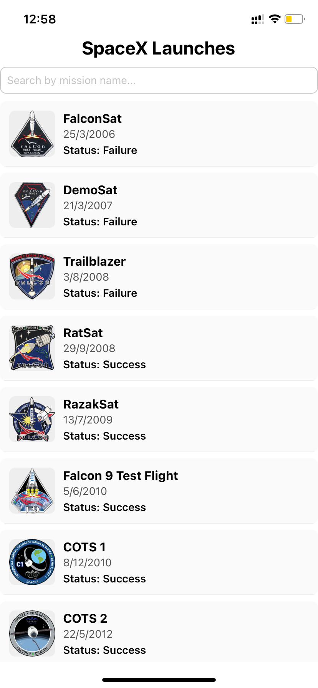
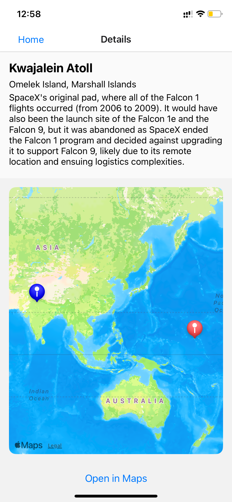
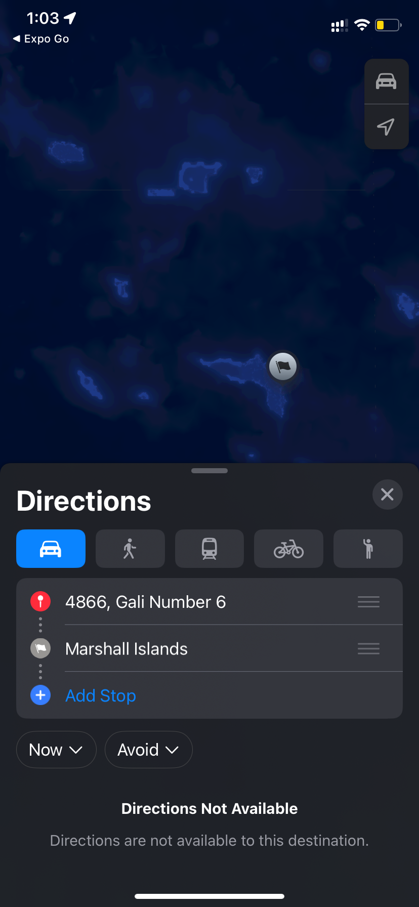

# 🚀 tripare

A React Native app (Expo) that lists SpaceX launches and shows launchpad locations on a map.

## Getting Started

1. **Clone the repository:**

   ```sh
   git clone https://github.com/vishu-jain/Tripare.git
   cd tripare
   ```

2. **Install dependencies:**

   ```sh
   npm install
   ```

3. **Start the app:**
   ```sh
   npx expo start
   ```
   - Use Expo Go on your device or an emulator to run the app.

---

## Map Implementation & Libraries Used

- **Map:**  
  The app uses [`react-native-maps`](https://github.com/react-native-maps/react-native-maps) to display launchpad locations and the user's current location.
- **Location:**  
  [`expo-location`](https://docs.expo.dev/versions/latest/sdk/location/) is used to request and access the device's current location.
- **Navigation:**  
  [`@react-navigation/native`](https://reactnavigation.org/) and [`@react-navigation/stack`](https://reactnavigation.org/docs/stack-navigator/) are used for screen navigation.

**Key files:**

- Map rendering and permission logic: [`DetailsScreen.tsx`](DetailsScreen.tsx)
- Navigation setup: [`navigation.tsx`](navigation.tsx)

---

## Permission Flows & Handling

- On the **Details** screen, the app requests foreground location permission using `Location.requestForegroundPermissionsAsync()`.
- If permission is **granted**, the user's location is shown on the map alongside the launchpad.
- If permission is **denied**, a message is displayed with a button to open device settings and enable location access.
- All permission and error handling is managed in [`DetailsScreen.tsx`](DetailsScreen.tsx).

---

## App Screenshots

| Launch List                           | Launchpad Details & Map                       |
| ------------------------------------- | --------------------------------------------- | ---------------------- |
|  |  |  |

---

## Project Structure

- `SpaceXList.tsx` – Launch list and search
- `DetailsScreen.tsx` – Launchpad details and map
- `navigation.tsx` – Navigation setup
- `ErrorBoundary.tsx` – Error boundary for UI errors
- `logHelper.ts` – Error logging helper
- `types.ts` – TypeScript types for SpaceX API

---

##
